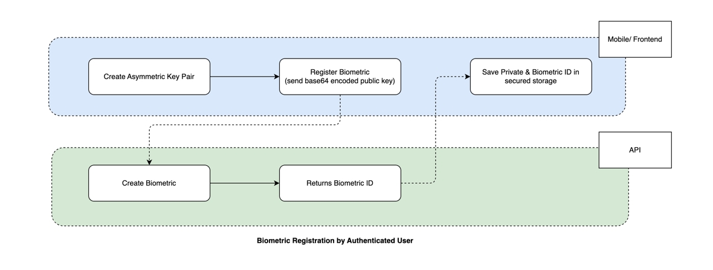

# A laravel package to provide asymmetric biometric authentication

[](https://packagist.org/packages/laranex/laravel-biometric-auth)
[](https://github.com/laranex/laravel-biometric-auth/actions?query=workflow%3Arun-tests+branch%3Amain)
[](https://github.com/laranex/laravel-biometric-auth/actions?query=workflow%3A"Fix+PHP+code+style+issues"+branch%3Amain)
[](https://packagist.org/packages/laranex/laravel-biometric-auth)




## Supported Public Keys
https://phpseclib.com/docs/publickeys

## Installation

You can install the package via composer:

```bash
composer require laranex/laravel-biometric-auth
```

You can publish and run the migrations with:

```bash
php artisan vendor:publish --tag="biometric-auth-migrations"
php artisan migrate
```

You can publish the config file with:

```bash
php artisan vendor:publish --tag="biometric-auth-config"
```

This is the contents of the published config file:

```php
<?php

return [
    'table' => env('BIOMETRIC_AUTH_TABLE', 'biometrics'),

    // You will need to be explicit about the encryption padding and hash algorithm when working with RSA keys.
    // For the rest of the algorithms, the package will automatically detect with the help of phpseclib.
    'rsa' => [
        'encryption_padding' => \phpseclib3\Crypt\RSA::SIGNATURE_PKCS1,
        'hash_algorithm' => 'sha256',
    ],
];

```

## Usage

```php
// Use Laranex\LaravelBiometricAuth\Traits\HasBiometrics in your Authenticable Model such as User, Admin
class User extends Authenticatable {
    use Laranex\LaravelBiometricAuth\Traits\HasBiometrics;
}

// Register a new biometric
$user->createBiometric("Base 64 encoded public key");

// Create a challenge for biometric authentication
$biometric = Laranex\LaravelBiometricAuth\Facades\LaravelBiometricAuth::getBiometric("UUID of a biometric");

// Verify the signature
Laranex\LaravelBiometricAuth\Facades\LaravelBiometricAuth::verifyBiometric("UUID of a biometric", "Signature");

// Get the user of verified biometric key
$user = Biometric::find("UUID of a biometric")->instance;

// Revoke a biometric
$user->revokeBiometric("UUID of a biometric");
```


## Changelog

Please see [CHANGELOG](CHANGELOG.md) for more information on what has changed recently.

## Contributing

Please see [CONTRIBUTING](CONTRIBUTING.md) for details.

## Security Vulnerabilities

Please review [our security policy](../../security/policy) on how to report security vulnerabilities.

## Credits

- [Nay Thu Khant](https://github.com/naythukhant)
- [All Contributors](../../contributors)

## License

The MIT License (MIT). Please see [License File](LICENSE.md) for more information.
